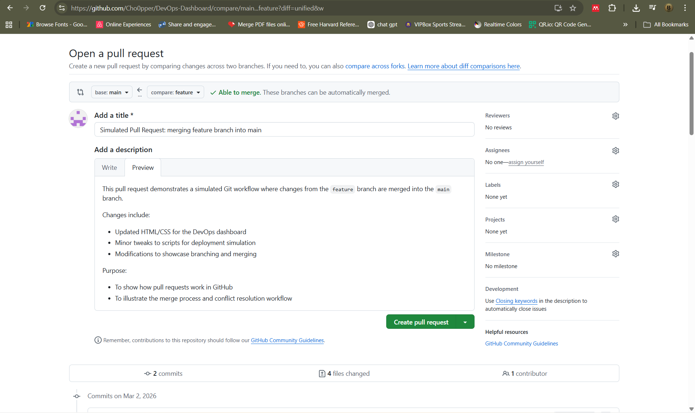
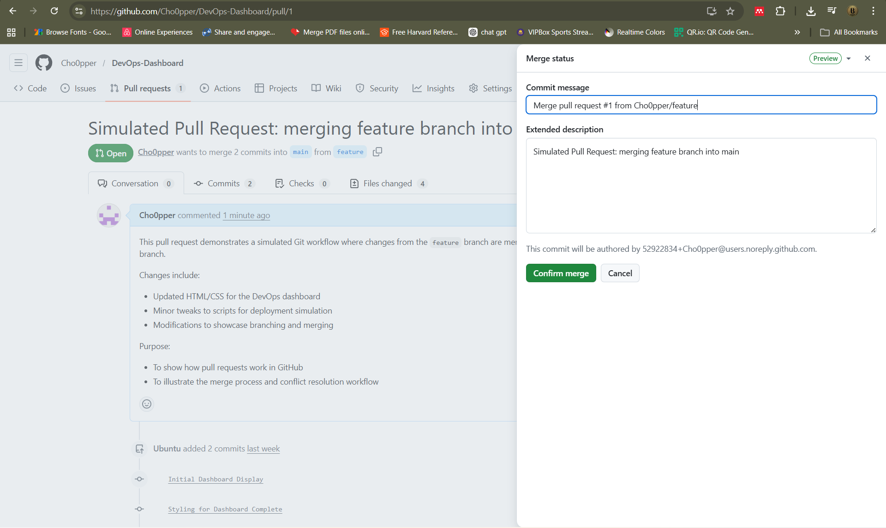
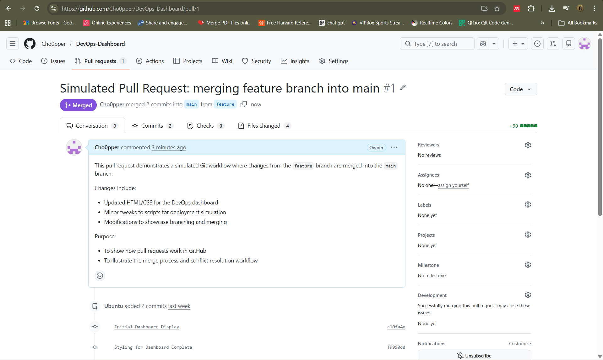

# DevOps-Dashboard
A simple DevOps simulation project to showcase Git workflows, including cloning, branching, committing, merging and pull requests. It also features a live deployment dashboard built with HTML, CSS and Bash scripts, complete with simulated deployment logs.

## Features
- **Git Workflow Mastery:** showcasing branching, committing, merging and pull requests in a real project setting.
- **Deployment Simulation:** Bash script (`deploy.sh`) simulates the deployment process with logs.
- **Live Dashboard:** HTML/CSS dashboard displays deployment status and logs.

## Setup / How to Run
**Clone the repository**
```bash
git clone https://github.com/Cho0pper/DevOps-Dashboard.git
cd DevOps-Dashboard
bash deploy.sh  
```

### Logs Used in the Dashboard
- **Original Logs**  
The original deployment logs are **ignored by Git** (`.gitignore`) to avoid sensitive information being pushed.  

- **Simulated Logs**  
This repository includes **simulated logs** that are used to populate the dashboard for demonstration purposes.

### Pull Requests & Merges
#### Pull Requests


#### Merge Results



    

## View the Dashboard
- Open `index.html` in a web browser.

## View Live Dashboard
- [Live Dashboard](https://Cho0pper.github.io/DevOps-Dashboard/)

## License
This project is licensed under the MIT License – see the [LICENSE](LICENSE) file for details.


